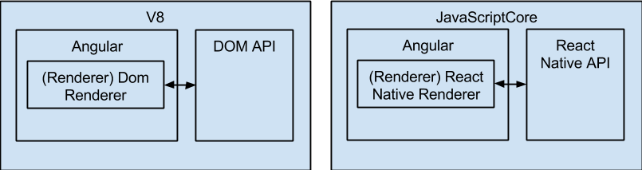

[Todo app demo on rnplay.org](https://rnplay.org/apps/88NRLQ)

This project is an Angular 2 renderer that renders to iOS. It replaces the usual DOM renderer in Angular 2 with a custom renderer that renders through React Native.

# Getting Started

If you're looking to install this through npm, see the [readme on the npm package sources](src/README.md).

You need a Mac with XCode and node. After cloning the repo, run:

	npm install

If you are having issues with tsd, run `tsd rate` to make sure you are not being rate limited by GitHub. If you see a 0/60, then you need to add a GitHub OAuth token with `tsd token`. More information can be found on the [tsd repo](https://github.com/DefinitelyTyped/tsd).

Then initialize an example:

	# usage: gulp init <example>
	gulp init todoApp

When modifying the example (src/EXAMPLE_NAME/\*\*) or the renderer (src/\*\*/*.ts), update by running:

	# usage: gulp build <example>
	gulp build todoApp

	# OR
	# usage gulp watch <example>
	gulp watch todoApp

To run the example:

	# usage: gulp open <example>
	gulp open todoApp

	# click the "run" button in XCode

To run tests:

	./scripts/build_and_test.sh

# react-native-renderer

This codebase is a hack that attempts to take the "React" part of React Native and replace it with Angular 2. I say that it is a hack because *some of the details of React Native described here are not documented in the React Native docs and are subject to change.* Also, everything here about how React Native works is just how I *think* it works, after some experimentation.

## React Native without React

*Internal modules can't be required this way in the future. See* https://github.com/facebook/react-native/issues/1821

React Native projects usually `require('react-native')` and then `React.AppRegistry.registerComponent`. To create an app without React, just `require('AppRegistry')` directly, and `AppRegistry.registerRunnable` instead. React Native also exposes `NativeModules` which provides access to native views through `NativeModules.UIManager`. Combine these to create a simple a "Hello World" application:

	//index.ios.js
	var AppRegistry = require('AppRegistry');
	var NativeModules = require('NativeModules');
	var UIManager = NativeModules.UIManager;

	AppRegistry.registerRunnable('ProjectName', function() {
		// create views
		UIManager.createView(2, "RCTView", null, {});
		UIManager.createView(3, "RCTText", null, {});
		UIManager.createView(4, "RCTRawText", null, {
			"text": "Hello World!"
		});

		// attach views
		// Note: the "root" native view is tag # 1
		UIManager.manageChildren(1, null, null, [2], [0], null);
		UIManager.manageChildren(2, null, null, [3], [0], null);
		UIManager.manageChildren(3, null, null, [4], [0], null);
	});
	
**The `AppRegistry` *always* has to be required first**, as it `requires` certain modules in the right order, and sets up polyfills for functions like `setTimeout`. After requiring it, any other module provided by React Native can be included without issue. `registerRunnable` allows React Native to start your application when the native side is ready.

## Angular 2 in JavaScriptCore

To run in JavaScriptCore, Angular 2 needs traceur-runtime, a DOM implementation to parse templates with (parse5), and properly patched async functions with zonejs.

...you'll also notice es6-shim included in the project. This is to fix some issue with Maps. Ideally this is not needed.

### traceur-runtime

Easy.

	require('traceur/bin/traceur-runtime.js');
	
### parse5

JavaScriptCore has no DOM. This is fixed with a couple lines of code:

	import { Parse5DomAdapter } from 'angular2/src/dom/parse5_adapter';
	
	Parse5DomAdapter.makeCurrent();
	
This is almost sufficient, but in this renderer, templates don't use elements like `
` and ``. They React Native elements like `<Text>` and `<View>`. The parse5 adapter is fine with custom tag names (just like HTML5 is), but it will still verify element properties. Ideally, the definitions of each element would be defined, the parse5 adapter could tell which properties are on which elements. Instead, this project just checks to make sure that a property is ANY valid React Native element property by replacing the parse5 adapter's `hasProperty`:

	class CustomParse5DomAdapter extends Parse5DomAdapter {
		static makeCurrent() { setRootDomAdapter(new CustomParse5DomAdapter()); }
		hasProperty(element, name: string): boolean {
			console.log(name);
			return RCT_PROPERTY_NAMES[name] !== undefined;
		}
	}
	
	CustomParse5DomAdapter.makeCurrent();
	
The parse5 adapter also uses the Node APIs `url` and `css`, which need to be patched before including the parse5 adapter.

Angular2's parse5 adapter uses parse5, but angular2 does not have it listed in its dependencies. Parse5 must be `npm install`ed.
	
### zonejs

zonejs needs a custom patch for React Native. This could be done through patching the polyfilled `setTimeout`-like functions and Promises. An easier (and faster) way to do it is to just patch the source of all async calls, which seems to be `ReactUpdates.batchedUpdates`. This needs to be patched on Angular's zone:

	bootstrap( ... ).then(function(appRef) {
		var zone = appRef._injector.get(NgZone)._innerZone;
		require('ReactUpdates').batchedUpdates = zone.bind(require('ReactUpdates').batchedUpdates);
	});

Any time the native side calls into JS, the application code will run, then zonejs will run detectChanges, and the results will then be returned to the native side.

# Evaluation

This project was tested on the iPhone Simulator, an iPhone 4, and an iPad 2.

## animations

There are 2 .mp4 files [in the video branch](https://github.com/angular/react-native-renderer/tree/video), demoing the app on the iPad and iPhone.

On the iPad, most animations almost feel native.

On the iPhone, many animations are slow, and gain an increasing delay over time. The animations in objective-c (react-native's LayoutAnimation) are still fairly fast.

## startup times

These are estimates, based on only a few logs.

On the iPhone 4:

	3 - 3.5s blocked on JS
		350ms on AppRegistry require
		150ms on es6-shims
		600ms on Parse5DomAdapter (the first angular2 require)
		100ms on traceur-runtime
		800ms requiring bind, Renderer, bootstrap from angular2
			600ms between bootstrap call and promise callback
			200ms in the first processBatch
			300ms between promiseBatch end and createRootHostView start
			40ms
			70ms spent on detectChanges
		800ms between first and second processBatch
			not sure what’s happening here... maybe React and/or React Native is being initialized?
	~7s from tapping app to visible UI
		~2s to go from tap (and black screen) to white screen w/fps
		~5s to see UI

## potential further development

 - [Re-use native elements](https://github.com/facebook/react-native/issues/1707)
 - Full implementation of all renderer functions